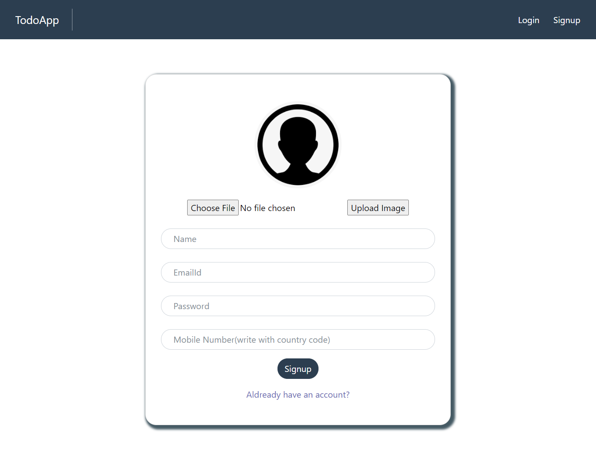
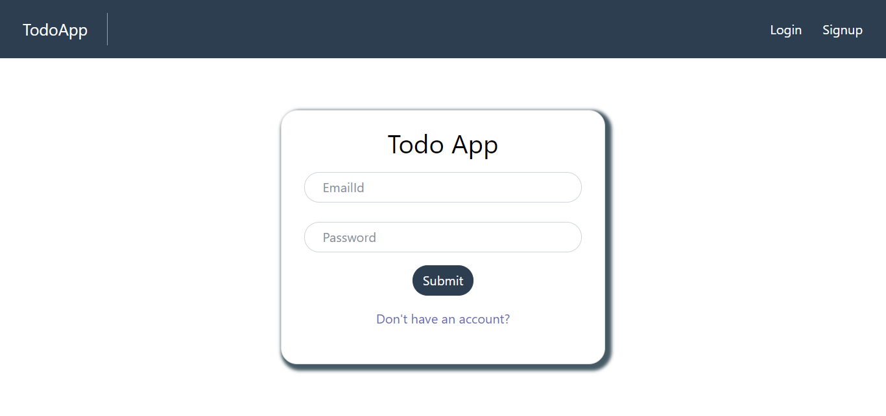

# MERNstack

This Repository contains both frontend and backend under two different branches(Server and Client).

## Features

### -->User Specific
### -->Sortby Groups and tags
### -->Quick Access through Whatsapp(Supports both text and voice message)
### -->Voice to text (for input fields)

## Project Screen Shots 

### Authentication Page

### Add categories and tags

### Add and update todo

### Use Speech Recogniser for Input fields

## Installation and Setup Instructions

Refer Server branch for backend and Client branch for frontend

## Demo

https://todoapp12345-39304.web.app/
